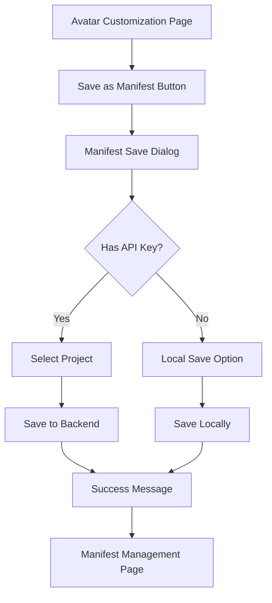

# Tài liệu Yêu cầu Tính năng: Save Avatar với Manifest Name

## 1. Tổng quan Sản phẩm

Tính năng này mở rộng chức năng save avatar hiện tại của MyRoom System bằng cách cho phép người dùng lưu cấu hình avatar dưới dạng manifest với tên tùy chỉnh. Tính năng tích hợp với manifest service API đã có ở backend để lưu trữ và quản lý các cấu hình avatar một cách có tổ chức.

Tính năng giải quyết nhu cầu lưu trữ và chia sẻ cấu hình avatar với tên có ý nghĩa, giúp người dùng dễ dàng quản lý và tái sử dụng các thiết lập avatar yêu thích.

## 2. Tính năng Cốt lõi

### 2.1 Vai trò Người dùng

| Vai trò | Phương thức Đăng ký | Quyền Cốt lõi |
|---------|---------------------|----------------|
| Developer | API Key từ backend | Có thể tạo, lưu, và quản lý avatar manifest trong project của mình |
| End User | Truy cập trực tiếp qua MyRoom System | Có thể tạo và lưu avatar manifest cục bộ |

### 2.2 Module Tính năng

Hệ thống yêu cầu bao gồm các trang chính sau:

1. **Avatar Customization Page**: Giao diện tùy chỉnh avatar với nút Save Manifest mới
2. **Manifest Save Dialog**: Dialog cho phép nhập tên manifest và mô tả
3. **Manifest Management Page**: Trang quản lý các manifest đã lưu
4. **Backend Integration**: Tích hợp với manifest service API

### 2.3 Chi tiết Trang

| Tên Trang | Tên Module | Mô tả Tính năng |
|-----------|------------|------------------|
| Avatar Customization Page | Save Manifest Button | Thêm nút "Save as Manifest" bên cạnh nút save hiện tại. Mở dialog nhập tên manifest |
| Avatar Customization Page | Current Avatar Display | Hiển thị cấu hình avatar hiện tại với preview 3D |
| Manifest Save Dialog | Manifest Name Input | Cho phép nhập tên manifest (bắt buộc, tối đa 100 ký tự) |
| Manifest Save Dialog | Description Input | Cho phép nhập mô tả manifest (tùy chọn, tối đa 500 ký tự) |
| Manifest Save Dialog | Project Selection | Dropdown chọn project (nếu có API key) |
| Manifest Save Dialog | Save Actions | Nút Save và Cancel với validation |
| Manifest Management Page | Manifest List | Hiển thị danh sách manifest đã lưu với tên, mô tả, ngày tạo |
| Manifest Management Page | Load Manifest | Cho phép load lại cấu hình avatar từ manifest |
| Manifest Management Page | Delete Manifest | Cho phép xóa manifest (với xác nhận) |

## 3. Quy trình Cốt lõi

### Developer Flow:
1. Developer tùy chỉnh avatar trong MyRoom System
2. Nhấn nút "Save as Manifest"
3. Nhập tên manifest và mô tả trong dialog
4. Chọn project từ dropdown
5. Hệ thống gọi API POST /api/manifest/projects/:projectId/manifests
6. Manifest được lưu vào backend với cấu trúc JSON chuẩn
7. Hiển thị thông báo thành công và manifest ID

### End User Flow:
1. End user tùy chỉnh avatar trong MyRoom System
2. Nhấn nút "Save as Manifest"
3. Nhập tên manifest và mô tả
4. Hệ thống lưu manifest cục bộ (localStorage hoặc download JSON)
5. Hiển thị thông báo thành công



## 4. Thiết kế Giao diện Người dùng

### 4.1 Phong cách Thiết kế

- **Màu chính**: #3b82f6 (blue-500) cho các nút chính
- **Màu phụ**: #6b7280 (gray-500) cho text phụ
- **Kiểu nút**: Rounded corners (border-radius: 8px) với shadow nhẹ
- **Font**: System font stack với kích thước 14px cho text thường, 16px cho tiêu đề
- **Layout**: Card-based design với spacing 16px
- **Icon**: Sử dụng emoji hoặc simple SVG icons

### 4.2 Tổng quan Thiết kế Trang

| Tên Trang | Tên Module | Các Phần tử UI |
|-----------|------------|----------------|
| Avatar Customization Page | Save Manifest Button | Button với icon 💾, màu #3b82f6, position: absolute top-right |
| Manifest Save Dialog | Dialog Container | Modal overlay với backdrop blur, centered card 400px width |
| Manifest Save Dialog | Form Fields | Input fields với label, border-radius 6px, focus ring blue |
| Manifest Save Dialog | Action Buttons | Save button (blue), Cancel button (gray), flex layout |
| Manifest Management Page | Manifest Cards | Grid layout với cards, hover effects, thumbnail preview |

### 4.3 Responsive Design

Sản phẩm được thiết kế desktop-first với mobile-adaptive. Dialog sẽ full-width trên mobile devices và có touch interaction optimization.

## 5. Cấu trúc Dữ liệu Manifest

```json
{
  "name": "My Custom Avatar",
  "description": "Avatar configuration for formal events",
  "manifestData": {
    "version": "1.0",
    "timestamp": "2025-01-21T10:30:00.000Z",
    "avatar": {
      "gender": "male",
      "parts": {
        "body": {
          "path": "/models/male/male_body/male_body.glb",
          "resourceId": "male-male_body-male_body"
        },
        "hair": {
          "path": "/models/male/male_hair/male_hair_001.glb",
          "resourceId": "male-male_hair-male_hair_001"
        },
        "top": {
          "path": "/models/male/male_top/male_top_001.glb",
          "resourceId": "male-male_top-male_top_001"
        }
      },
      "colors": {
        "hair": "#4A301B",
        "top": "#1E90FF"
      }
    }
  },
  "metadata": {
    "createdBy": "myroom-system",
    "avatarType": "custom",
    "tags": ["formal", "male"]
  }
}
```

## 6. Tích hợp API Backend

### 6.1 Endpoints Sử dụng

- **POST /api/manifest/projects/:projectId/manifests**: Tạo manifest mới
- **GET /api/manifest/projects/:projectId/manifests**: Lấy danh sách manifest
- **GET /api/manifest/:id**: Lấy chi tiết manifest
- **PUT /api/manifest/:id**: Cập nhật manifest
- **DELETE /api/manifest/:id**: Xóa manifest

### 6.2 Authentication

Sử dụng API Key authentication với scope 'manifest:write' và 'manifest:read'.

### 6.3 Error Handling

- Network errors: Hiển thị toast notification với retry option
- Validation errors: Highlight field lỗi với error message
- Permission errors: Redirect to authentication hoặc show permission denied message
