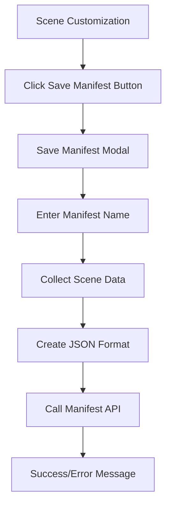

# Save Complete Scene with Manifest Name - Product Requirements Document

## 1. Product Overview
Thêm tính năng "Save Manifest" vào myroom-system cho phép người dùng lưu toàn bộ cấu hình hiện tại (bao gồm room, avatar và items) dưới dạng manifest với tên tùy chỉnh. Tính năng này tích hợp với backend Manifest API đã có để lưu trữ và quản lý các preset hoàn chỉnh của người dùng.
- Giải quyết nhu cầu lưu trữ và chia sẻ các cấu hình scene hoàn chỉnh đã tùy chỉnh
- Tích hợp với hệ thống manifest service hiện có để quản lý dữ liệu một cách nhất quán

## 2. Core Features

### 2.1 User Roles
| Role | Registration Method | Core Permissions |
|------|---------------------|------------------|
| Default User | Direct access | Can customize scene, save and load manifests |

### 2.2 Feature Module
Tính năng Save Manifest bao gồm các trang chính sau:
1. **Scene Control Panel**: Thêm nút "Save Manifest" vào thanh điều khiển hiện có
2. **Save Manifest Modal**: Giao diện nhập tên và lưu manifest hoàn chỉnh

### 2.3 Page Details

| Page Name | Module Name | Feature description |
|-----------|-------------|---------------------|
| Scene Control Panel | Save Manifest Button | Thêm nút "Save Manifest" vào SceneControlButtons component, kích hoạt modal lưu manifest |
| Save Manifest Modal | Name Input | Cho phép người dùng nhập tên cho manifest scene hoàn chỉnh |
| Save Manifest Modal | Save Action | Thu thập toàn bộ cấu hình hiện tại (room, avatar, items), tạo JSON data theo format preset, gọi API lưu manifest |
| Save Manifest Modal | Error Handling | Hiển thị thông báo lỗi nếu việc lưu thất bại, validation tên manifest |

## 3. Core Process
Quy trình chính cho tính năng Save Manifest:

1. **Người dùng tương tác**: Người dùng tùy chỉnh scene (room, avatar, items), sau đó nhấn nút "Save Manifest"
2. **Hiển thị Modal**: Hệ thống hiển thị modal cho phép nhập tên manifest
3. **Thu thập dữ liệu**: Hệ thống thu thập toàn bộ cấu hình hiện tại từ scene state (room, avatar, items)
4. **Tạo JSON**: Chuyển đổi cấu hình thành format JSON tương thích với preset hiện có
5. **Gọi API**: Gửi request đến backend Manifest API để lưu manifest
6. **Xác nhận**: Hiển thị thông báo thành công hoặc lỗi cho người dùng



## 4. User Interface Design

### 4.1 Design Style
- **Primary Colors**: Blue (#3B82F6), White (#FFFFFF)
- **Secondary Colors**: Gray (#6B7280), Light Gray (#F3F4F6)
- **Button Style**: Rounded corners (8px), subtle shadows
- **Font**: System font stack, 14px base size
- **Layout Style**: Modal-based overlay, clean minimal design
- **Icons**: Outline style icons, consistent with existing UI

### 4.2 Page Design Overview

| Page Name | Module Name | UI Elements |
|-----------|-------------|-------------|
| Scene Control Panel | Save Manifest Button | Icon button với tooltip "Save Scene", màu primary (#3B82F6), kích thước 40x40px, bo góc 8px |
| Save Manifest Modal | Modal Container | Overlay màu đen trong suốt 50%, modal trắng 400x300px, shadow lớn, bo góc 12px |
| Save Manifest Modal | Input Field | Text input với label "Scene Name", border màu xám, focus state màu primary, placeholder "Enter scene name" |
| Save Manifest Modal | Action Buttons | "Cancel" button (secondary style), "Save" button (primary style), spacing 12px |

### 4.3 Responsiveness
Desktop-first design với mobile-adaptive modal. Touch interaction optimization cho mobile devices.

## 5. Technical Implementation Details

### 5.1 Data Structure
Dữ liệu manifest sẽ theo format của preset hiện có:
```json
{
  "version": "1.0",
  "timestamp": "2024-01-01T00:00:00Z",
  "room": {
    "name": "room_name",
    "path": "path/to/room.glb",
    "resourceId": "room_resource_id"
  },
  "avatar": {
    "gender": "male/female",
    "parts": {
      "hair": {"path": "path/to/hair.glb", "resourceId": "hair_id"},
      "top": {"path": "path/to/top.glb", "resourceId": "top_id"},
      "bottom": {"path": "path/to/bottom.glb", "resourceId": "bottom_id"},
      "shoes": {"path": "path/to/shoes.glb", "resourceId": "shoes_id"}
    },
    "colors": {
      "hair": "#color_hex",
      "top": "#color_hex"
    }
  },
  "items": []
}
```

### 5.2 API Integration
- **Endpoint**: `POST /api/manifest/projects/:projectId/manifests`
- **Authentication**: API Key trong header
- **Payload**: Manifest data, name, description
- **Response**: Manifest ID và thông tin đã lưu

### 5.3 Component Integration
- **SceneControlButtons**: Thêm nút Save Manifest
- **Modal Component**: Tạo SaveManifestModal component mới
- **State Management**: Tích hợp với scene state để thu thập dữ liệu
- **API Service**: Sử dụng manifest service đã có