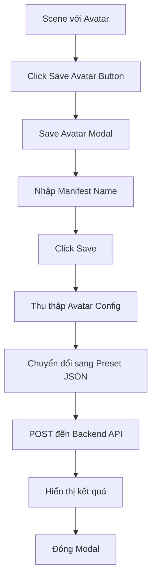

# Tính năng Save Avatar với Manifest Name

## 1. Tổng quan sản phẩm

Thêm tính năng lưu cấu hình avatar hiện tại với tên manifest tùy chỉnh vào MyRoom System, tích hợp với backend manifest service đã có. Tính năng này cho phép người dùng lưu trạng thái avatar hiện tại dưới dạng JSON manifest và quản lý thông qua backend API.

Mục tiêu chính là mở rộng khả năng lưu trữ và quản lý cấu hình avatar, tạo cầu nối giữa frontend myroom-system và backend manifest service.

## 2. Tính năng chính

### 2.1 Vai trò người dùng

| Vai trò | Phương thức truy cập | Quyền hạn chính |
|---------|---------------------|------------------|
| Default User | Truy cập trực tiếp vào myroom-system | Có thể tùy chỉnh avatar, lưu cấu hình với tên manifest |

### 2.2 Module tính năng

Hệ thống yêu cầu bao gồm các trang chính sau:

1. **Scene Control Interface**: giao diện điều khiển cảnh với nút Save Avatar mới
2. **Save Avatar Modal**: modal nhập tên manifest và xác nhận lưu
3. **Avatar Configuration Handler**: xử lý thu thập và chuyển đổi dữ liệu avatar

### 2.3 Chi tiết trang

| Tên trang | Tên module | Mô tả tính năng |
|-----------|------------|----------------|
| Scene Control Interface | Save Avatar Button | Thêm nút "Save Avatar" vào SceneControlButtons component, hiển thị icon 💾, kích hoạt modal save |
| Save Avatar Modal | Manifest Name Input | Hiển thị input field để nhập tên manifest, validation tên không trống, nút Cancel và Save |
| Save Avatar Modal | Avatar Data Collection | Thu thập cấu hình avatar hiện tại (gender, parts, colors), chuyển đổi sang định dạng preset JSON |
| Save Avatar Modal | Backend Integration | Gửi request POST đến /api/manifest/projects/:projectId/manifests với manifestData chứa avatar config |
| Scene Control Interface | Save Status Feedback | Hiển thị thông báo thành công/lỗi sau khi lưu, loading state trong quá trình xử lý |

## 3. Quy trình chính

**Quy trình Save Avatar:**
1. Người dùng tùy chỉnh avatar trong scene
2. Click nút "Save Avatar" trong SceneControlButtons
3. Modal hiển thị với input field để nhập tên manifest
4. Người dùng nhập tên manifest và click Save
5. Hệ thống thu thập cấu hình avatar hiện tại (AvatarConfig)
6. Chuyển đổi dữ liệu sang định dạng preset JSON tương tự default-preset.json
7. Gửi POST request đến backend manifest API
8. Hiển thị thông báo kết quả cho người dùng
9. Đóng modal sau khi thành công

## 4. Thiết kế giao diện người dùng

### 4.1 Phong cách thiết kế

- **Màu chính và phụ**: Sử dụng theme hiện tại của myroom-system, nút Save Avatar với background rgba(0, 0, 0, 0.3)
- **Phong cách nút**: Rounded button với backdrop filter blur, icon 💾, kích thước 32x32px
- **Font và kích thước**: Sử dụng font system hiện tại, fontSize 16px cho button, 14px cho modal text
- **Phong cách layout**: Modal overlay với backdrop blur, centered modal box với padding 20px
- **Icon và emoji**: Sử dụng emoji 💾 cho Save button, checkmark ✅ cho success, error ❌ cho lỗi

### 4.2 Tổng quan thiết kế trang

| Tên trang | Tên module | Các thành phần UI |
|-----------|------------|------------------|
| Scene Control Interface | Save Avatar Button | Button với background rgba(0, 0, 0, 0.3), color white, border-radius 4px, icon 💾, position trong button group |
| Save Avatar Modal | Modal Container | Overlay với backdrop-filter blur(10px), centered modal box với background white, border-radius 8px, box-shadow |
| Save Avatar Modal | Input Form | Label "Manifest Name", input field với border, placeholder "Enter manifest name...", validation message area |
| Save Avatar Modal | Action Buttons | Cancel button (secondary style), Save button (primary blue), loading spinner khi processing |
| Save Avatar Modal | Status Messages | Success message với green background, error message với red background, auto-hide sau 3 giây |

### 4.3 Responsive Design

Sản phẩm được thiết kế desktop-first với mobile-adaptive. Modal sẽ responsive trên các kích thước màn hình khác nhau, touch interaction được tối ưu cho mobile devices