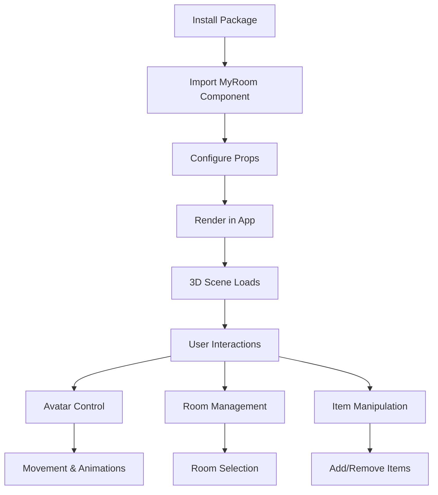

# MyRoom System Refactor Requirements

## 1. Product Overview
Refactor the existing MyRoom System into a clean, reusable React component package that can be easily integrated into React and NextJS applications while maintaining all current functionalities.

The main purpose is to transform the current monolithic structure into a modular, well-organized library that developers can easily install and use in their projects. This will improve maintainability, reusability, and developer experience.

## 2. Core Features

### 2.1 Feature Module
Our refactored MyRoom System consists of the following main components:
1. **MyRoom Component**: Main 3D room and avatar integration component with full scene management
2. **Avatar System**: Standalone avatar customization and control system
3. **Room Manager**: Interactive room loading and item management system
4. **Item Controller**: Dynamic furniture and object manipulation tools
5. **Configuration Panel**: Settings and customization interface
6. **API Integration**: Service layer for backend communication
7. **Export Utilities**: Helper functions and hooks for easy integration

### 2.2 Page Details

| Component Name | Module Name | Feature Description |
|----------------|-------------|--------------------|
| MyRoom Component | Core Scene | Initialize 3D scene with Babylon.js, load room models, manage avatar integration, handle user interactions |
| MyRoom Component | Scene Controls | Camera controls, lighting management, post-processing effects, skybox configuration |
| Avatar System | Avatar Loader | Load male/female avatar models, apply animations, handle avatar customization |
| Avatar System | Movement Controls | Keyboard/touch movement, gesture animations (wave, dance), collision detection |
| Room Manager | Room Selection | Browse available rooms, load room models, switch between different room types |
| Room Manager | Room Rendering | 3D room visualization, lighting setup, texture management |
| Item Controller | Item Library | Browse available furniture items, categorized item selection |
| Item Controller | Item Manipulation | Add/remove items, position/rotation/scale controls, gizmo tools |
| Configuration Panel | Settings UI | Compact/ultra-compact modes, debug information display |
| Configuration Panel | Preset Management | Save/load scene configurations, export/import presets |
| API Integration | Resource Service | Load 3D models, textures, animations from backend or CDN |
| API Integration | Manifest Service | Manage item/room/avatar manifests, caching system |
| Export Utilities | React Hooks | Custom hooks for avatar control, scene management, item manipulation |
| Export Utilities | Helper Functions | Utility functions for configuration, type definitions, constants |

## 3. Core Process

### Main Integration Flow
Developers install the package, import the MyRoom component, and integrate it into their React/NextJS application with minimal configuration. The component handles all 3D scene setup, resource loading, and user interactions internally.

### Component Usage Flow
Users can interact with the 3D scene through built-in controls - selecting rooms, customizing avatars, adding/removing items, and controlling avatar movements. All interactions are managed through React state and props.

## 4. User Interface Design

### 4.1 Design Style
- **Primary Colors**: Modern blue (#3B82F6) and white (#FFFFFF)
- **Secondary Colors**: Gray tones (#6B7280, #F3F4F6) for UI elements
- **Button Style**: Rounded corners with subtle shadows and hover effects
- **Font**: System fonts (Inter, -apple-system, BlinkMacSystemFont)
- **Layout Style**: Clean, minimalist design with floating panels and overlay controls
- **Icons**: Lucide React icons for consistency and modern appearance

### 4.2 Page Design Overview

| Component Name | Module Name | UI Elements |
|----------------|-------------|-------------|
| MyRoom Component | Main Canvas | Full-screen 3D canvas with Babylon.js, transparent overlay controls |
| MyRoom Component | Control Overlay | Floating panels with semi-transparent backgrounds, rounded corners |
| Avatar System | Avatar Controls | Compact control panel with gender selection, customization options |
| Avatar System | Movement UI | Touch-friendly movement controls, gesture buttons |
| Room Manager | Room Selector | Dropdown menu with room thumbnails, smooth transitions |
| Item Controller | Item Panel | Categorized item grid, drag-and-drop interface |
| Item Controller | Manipulation Tools | Gizmo controls for position/rotation/scale, property panels |
| Configuration Panel | Settings Modal | Tabbed interface for different settings categories |

### 4.3 Responsiveness
The component is designed mobile-first with touch-optimized controls. It adapts to different screen sizes and provides appropriate interaction methods for both desktop and mobile devices.

## 5. Technical Requirements

### 5.1 Package Structure
- Clean separation between core components and demo applications
- Proper TypeScript definitions and exports
- Optimized bundle size with tree-shaking support
- Peer dependencies for React and React-DOM

### 5.2 Build Configuration
- Vite-based build system for optimal performance
- Multiple output formats (ES modules, UMD)
- Proper externalization of dependencies
- TypeScript declaration files generation

### 5.3 Integration Requirements
- Simple import and usage in React/NextJS projects
- Configurable props for customization
- Event callbacks for integration with parent applications
- SSR compatibility for NextJS applications