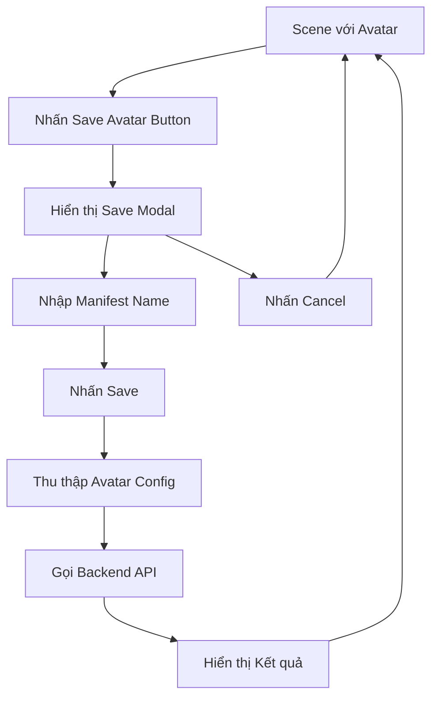

# Tài liệu Yêu cầu Sản phẩm: Tính năng Save Avatar với Manifest Name

## 1. Tổng quan Sản phẩm

Thêm tính năng lưu cấu hình avatar hiện tại với tên manifest tùy chỉnh vào MyRoom System, tích hợp với backend manifest service để lưu trữ và quản lý các cấu hình avatar.

Tính năng này cho phép người dùng lưu cấu hình avatar hiện tại dưới dạng JSON với tên manifest tùy chỉnh, sử dụng API backend để lưu trữ an toàn và có thể truy xuất sau này.

## 2. Tính năng Cốt lõi

### 2.1 Vai trò Người dùng

| Vai trò | Phương thức Đăng ký | Quyền Cốt lõi |
|---------|---------------------|----------------|
| Default User | Truy cập trực tiếp | Có thể tùy chỉnh avatar, lưu cấu hình với tên manifest |

### 2.2 Module Tính năng

Yêu cầu của chúng ta bao gồm các trang chính sau:

1. **Scene Control Interface**: Giao diện điều khiển cảnh với nút Save Avatar mới
2. **Save Avatar Modal**: Modal nhập tên manifest và xác nhận lưu
3. **Avatar Configuration Management**: Quản lý cấu hình avatar hiện tại

### 2.3 Chi tiết Trang

| Tên Trang | Tên Module | Mô tả Tính năng |
|-----------|------------|------------------|
| Scene Control Interface | Save Avatar Button | Thêm nút "Save Avatar" vào SceneControlButtons component, hiển thị icon 💾, kích hoạt modal save |
| Save Avatar Modal | Manifest Name Input | Hiển thị modal với input field để nhập tên manifest, validation tên không trống, nút Cancel và Save |
| Save Avatar Modal | Avatar Data Collection | Thu thập cấu hình avatar hiện tại (gender, parts, colors) theo format preset, chuẩn bị dữ liệu JSON |
| Save Avatar Modal | Backend Integration | Gọi POST /api/manifest/projects/:projectId/manifests với manifestData chứa cấu hình avatar |
| Scene Control Interface | Save Feedback | Hiển thị thông báo thành công/lỗi sau khi lưu, loading state trong quá trình save |

## 3. Quy trình Cốt lõi

**Quy trình Save Avatar:**
1. Người dùng tùy chỉnh avatar trong scene
2. Nhấn nút "Save Avatar" trong SceneControlButtons
3. Modal hiển thị với input field để nhập tên manifest
4. Nhập tên manifest và nhấn Save
5. System thu thập cấu hình avatar hiện tại
6. Gọi backend API để lưu manifest
7. Hiển thị thông báo kết quả



## 4. Thiết kế Giao diện Người dùng

### 4.1 Phong cách Thiết kế

- **Màu chính**: Sử dụng theme hiện tại của SceneControlButtons (rgba(0, 0, 0, 0.3) background)
- **Kiểu nút**: Rounded buttons với backdrop blur effect, consistent với existing buttons
- **Font**: Sử dụng font system hiện tại
- **Layout**: Modal overlay với centered positioning
- **Icon**: 💾 (save icon) cho Save Avatar button

### 4.2 Tổng quan Thiết kế Trang

| Tên Trang | Tên Module | Các Phần tử UI |
|-----------|------------|----------------|
| Scene Control Interface | Save Avatar Button | Button với style giống existing buttons, icon 💾, tooltip "Save Avatar", positioned trong button group |
| Save Avatar Modal | Modal Container | Overlay với backdrop blur, centered modal box, rounded corners, shadow effect |
| Save Avatar Modal | Input Form | Label "Manifest Name", text input với placeholder, validation message area |
| Save Avatar Modal | Action Buttons | Cancel button (secondary style), Save button (primary style), loading spinner khi processing |

### 4.3 Responsive Design

Desktop-first design với mobile-adaptive modal, touch-friendly button sizes, modal tự động điều chỉnh kích thước theo viewport.

## 5. Yêu cầu Kỹ thuật

### 5.1 Frontend Implementation

- **Component Updates**: Modify SceneControlButtons.tsx để thêm Save Avatar button
- **New Components**: Tạo SaveAvatarModal component
- **State Management**: Quản lý modal state, form input, loading state
- **Data Collection**: Function để thu thập current avatar configuration
- **API Integration**: Service để gọi backend manifest API

### 5.2 Backend Integration

- **Endpoint**: POST /api/manifest/projects/:projectId/manifests
- **Request Format**: 
  ```json
  {
    "name": "user-input-manifest-name",
    "description": "Avatar configuration saved from MyRoom System",
    "manifestData": {
      "version": "1.0",
      "timestamp": "ISO-date-string",
      "avatar": {
        "gender": "male|female",
        "parts": { /* avatar parts config */ },
        "colors": { /* color config */ }
      }
    }
  }
  ```

### 5.3 Data Format

Avatar manifest data sẽ follow format của existing preset files:
- Version và timestamp
- Avatar gender và parts configuration
- Colors configuration
- Tương thích với existing avatar loading system

## 6. Acceptance Criteria

1. ✅ Save Avatar button xuất hiện trong SceneControlButtons
2. ✅ Modal hiển thị khi nhấn Save Avatar button
3. ✅ Input validation cho manifest name (không trống)
4. ✅ Thu thập đúng avatar configuration hiện tại
5. ✅ Gọi backend API thành công với đúng format
6. ✅ Hiển thị loading state và feedback messages
7. ✅ Modal đóng sau khi save thành công
8. ✅ Error handling cho API failures
9. ✅ Responsive design trên mobile và