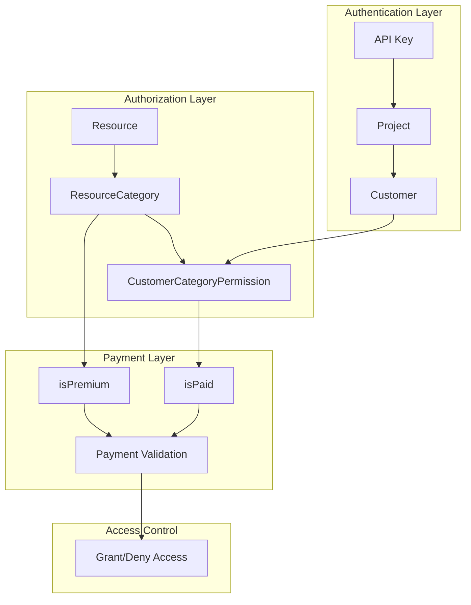
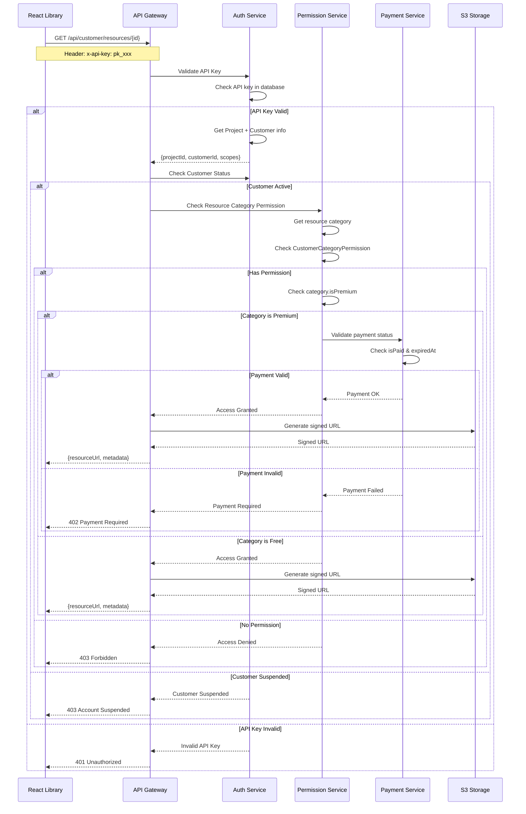

# MyRoom Resource Authorization System

## Tổng quan

Tài liệu này mô tả chi tiết cơ chế phân quyền tài nguyên (Resource Authorization) trong hệ thống MyRoom, bao gồm kiến trúc đa tầng, luồng xác thực, và các quy tắc phân quyền.

## 1. Kiến trúc phân quyền

### 1.1. Các thành phần chính



### 1.2. Entities và mối quan hệ

#### **Customer (Khách hàng)**
- Đăng ký sử dụng dịch vụ MyRoom
- Có thể tạo nhiều projects
- Có trạng thái: `active`, `suspended`, `inactive`

#### **Project (Dự án)**
- Thuộc về một Customer
- Mỗi project có API Key riêng
- Quản lý tài nguyên theo project

#### **API Key**
- Xác thực cho mỗi request từ React Library
- Liên kết với một Project cụ thể
- Có thể có scopes giới hạn quyền

#### **Resource (Tài nguyên)**
- 3D models, textures, animations
- Thuộc về một ResourceCategory
- Có access policy: `public`, `private`, `project-only`, `customers-only`

#### **ResourceCategory (Danh mục tài nguyên)**
- Phân loại tài nguyên: "bàn", "ghế", "tivi", "tủ lạnh"...
- Có thuộc tính `isPremium` (miễn phí/trả phí)
- Có giá `price` nếu là premium

#### **CustomerCategoryPermission (Quyền truy cập)**
- Quyền của Customer đối với từng Category
- Trạng thái thanh toán `isPaid`
- Thời hạn `expiredAt`

## 2. Cơ chế phân quyền đa tầng

### 2.1. Tầng 1: Xác thực API Key

```typescript
interface APIKeyValidation {
  apiKey: string;
  projectId: string;
  customerId: string;
  status: 'active' | 'revoked' | 'expired';
  scopes?: string[];
  lastUsedAt: Date;
}
```

**Quy trình:**
1. React Library gửi request với header `x-api-key`
2. Hệ thống validate API Key trong database
3. Lấy thông tin Project và Customer liên kết
4. Kiểm tra status của API Key

**Kết quả:**
- ✅ Valid: Tiếp tục tầng 2
- ❌ Invalid: Return `401 Unauthorized`

### 2.2. Tầng 2: Kiểm tra trạng thái Customer

```typescript
interface CustomerStatus {
  id: string;
  status: 'active' | 'suspended' | 'inactive';
  suspendedAt?: Date;
  suspendedReason?: string;
}
```

**Quy trình:**
1. Kiểm tra `customer.status`
2. Nếu `suspended`, kiểm tra thời hạn suspension
3. Admin có thể suspend/activate customer bất kỳ lúc nào

**Kết quả:**
- ✅ Active: Tiếp tục tầng 3
- ❌ Suspended: Return `403 Account Suspended`
- ❌ Inactive: Return `403 Account Inactive`

### 2.3. Tầng 3: Phân quyền theo Category

```typescript
interface CategoryPermission {
  customerId: string;
  categoryId: string;
  isPaid: boolean;
  grantedAt: Date;
  expiredAt?: Date;
  paidAmount?: number;
}
```

**Quy trình:**
1. Xác định category của resource được request
2. Kiểm tra CustomerCategoryPermission
3. Validate thời hạn permission (nếu có `expiredAt`)

**Kết quả:**
- ✅ Has Permission: Tiếp tục tầng 4
- ❌ No Permission: Return `403 Forbidden`
- ❌ Expired: Return `403 Permission Expired`

### 2.4. Tầng 4: Kiểm tra Premium & Payment

```typescript
interface PremiumValidation {
  categoryId: string;
  isPremium: boolean;
  price?: number;
  customerPermission: {
    isPaid: boolean;
    paidAmount?: number;
    expiredAt?: Date;
  };
}
```

**Quy trình:**
1. Kiểm tra `category.isPremium`
2. Nếu premium, validate `permission.isPaid`
3. Kiểm tra thời hạn thanh toán
4. Validate số tiền đã trả

**Kết quả:**
- ✅ Free Category: Grant access
- ✅ Premium + Paid: Grant access
- ❌ Premium + Unpaid: Return `402 Payment Required`
- ❌ Premium + Expired: Return `402 Payment Expired`

## 3. Luồng xác thực chi tiết

### 3.1. Sequence Diagram



### 3.2. Code Implementation Example

```typescript
// Authorization Service
class ResourceAuthorizationService {
  async authorizeResourceAccess(
    apiKey: string, 
    resourceId: string
  ): Promise<AuthorizationResult> {
    
    // Tầng 1: Validate API Key
    const apiKeyData = await this.validateAPIKey(apiKey);
    if (!apiKeyData.isValid) {
      return { granted: false, reason: 'INVALID_API_KEY', statusCode: 401 };
    }
    
    // Tầng 2: Check Customer Status
    const customer = await this.getCustomer(apiKeyData.customerId);
    if (customer.status !== 'active') {
      return { 
        granted: false, 
        reason: 'CUSTOMER_SUSPENDED', 
        statusCode: 403,
        message: `Account ${customer.status}` 
      };
    }
    
    // Tầng 3: Get Resource & Category
    const resource = await this.getResource(resourceId);
    const category = await this.getResourceCategory(resource.categoryId);
    
    // Check Category Permission
    const permission = await this.getCustomerCategoryPermission(
      customer.id, 
      category.id
    );
    
    if (!permission) {
      return { 
        granted: false, 
        reason: 'NO_CATEGORY_PERMISSION', 
        statusCode: 403 
      };
    }
    
    // Check permission expiry
    if (permission.expiredAt && permission.expiredAt < new Date()) {
      return { 
        granted: false, 
        reason: 'PERMISSION_EXPIRED', 
        statusCode: 403 
      };
    }
    
    // Tầng 4: Check Premium & Payment
    if (category.isPremium) {
      if (!permission.isPaid) {
        return { 
          granted: false, 
          reason: 'PAYMENT_REQUIRED', 
          statusCode: 402,
          paymentInfo: {
            categoryName: category.name,
            price: category.price
          }
        };
      }
    }
    
    // All checks passed
    return { 
      granted: true, 
      resource,
      signedUrl: await this.generateS3SignedUrl(resource.s3Key)
    };
  }
}

interface AuthorizationResult {
  granted: boolean;
  reason?: string;
  statusCode?: number;
  message?: string;
  resource?: Resource;
  signedUrl?: string;
  paymentInfo?: {
    categoryName: string;
    price: number;
  };
}
```

## 4. Các loại quyền truy cập

### 4.1. Access Policy Levels

| Policy | Mô tả | Áp dụng |
|--------|-------|----------|
| `public` | Tất cả có thể truy cập | Demo resources, free assets |
| `private` | Chỉ owner project | Private uploads |
| `project-only` | Trong cùng project | Shared project resources |
| `customers-only` | Chỉ customers có permission | Premium content |

### 4.2. API Key Scopes

```typescript
interface APIKeyScopes {
  resources: {
    read: boolean;
    write: boolean;
    categories: string[]; // Giới hạn categories
  };
  manifests: {
    read: boolean;
    write: boolean;
  };
  analytics: {
    read: boolean;
  };
}
```

**Ví dụ scopes:**
- `read:resources:furniture` - Chỉ đọc resources category furniture
- `read:manifests` - Chỉ đọc manifests
- `write:resources:*` - Ghi tất cả resources

## 5. Ví dụ thực tế

### 5.1. Scenario 1: Truy cập thành công

**Setup:**
- Customer: "FurnitureStore" (status: active)
- Project: "WebsiteShowroom" 
- API Key: "pk_abc123..." (active)
- Resource: "Ghế sofa cao cấp" (category: "furniture_premium")
- Permission: Customer có quyền "furniture_premium", đã trả phí

**Flow:**
```
1. React Library → GET /api/customer/resources/sofa-123
   Header: x-api-key: pk_abc123...

2. Validate API Key ✅
   → Project: WebsiteShowroom, Customer: FurnitureStore

3. Check Customer Status ✅
   → Status: active

4. Check Category Permission ✅
   → Has permission for "furniture_premium"

5. Check Payment ✅
   → isPaid: true, expiredAt: 2025-12-31

6. Generate S3 Signed URL ✅
   → Return: {resourceUrl: "https://s3.../sofa-123.glb?signature=..."}
```

### 5.2. Scenario 2: Payment Required

**Setup:**
- Customer: "StartupCompany" (status: active)
- Resource: "Tivi Samsung 8K" (category: "electronics_premium")
- Permission: Customer chưa có quyền "electronics_premium"

**Flow:**
```
1-3. API Key + Customer Status ✅

4. Check Category Permission ❌
   → No permission for "electronics_premium"

5. Return: 403 Forbidden
   {
     "error": "NO_CATEGORY_PERMISSION",
     "message": "Access denied to category: electronics_premium",
     "paymentRequired": {
       "categoryName": "Electronics Premium",
       "price": 99.99,
       "currency": "USD"
     }
   }
```

### 5.3. Scenario 3: Account Suspended

**Setup:**
- Customer: "ViolatingUser" (status: suspended)
- Reason: Violation of terms of service

**Flow:**
```
1. API Key Validation ✅

2. Check Customer Status ❌
   → Status: suspended

3. Return: 403 Account Suspended
   {
     "error": "CUSTOMER_SUSPENDED",
     "message": "Your account has been suspended. Contact support.",
     "suspendedAt": "2025-01-15T10:30:00Z",
     "supportEmail": "support@myroom.com"
   }
```

## 6. Admin Management

### 6.1. Customer Management

Admin có thể:
- **Suspend/Activate customers**: Tạm khóa/kích hoạt tài khoản
- **View usage analytics**: Xem thống kê sử dụng
- **Manage permissions**: Cấp/thu hồi quyền category
- **Reset API keys**: Tạo lại API key khi cần

### 6.2. Category Management

```typescript
interface CategoryManagement {
  createCategory(data: {
    name: string;
    description: string;
    isPremium: boolean;
    price?: number;
  }): Promise<ResourceCategory>;
  
  grantCategoryPermission(data: {
    customerId: string;
    categoryId: string;
    duration?: number; // days
    paidAmount?: number;
  }): Promise<CustomerCategoryPermission>;
  
  revokeCategoryPermission(
    customerId: string, 
    categoryId: string
  ): Promise<void>;
}
```

### 6.3. Analytics & Monitoring

```typescript
interface UsageAnalytics {
  getCustomerUsage(customerId: string, period: DateRange): Promise<{
    totalRequests: number;
    resourcesAccessed: string[];
    categoriesUsed: string[];
    paymentStatus: PaymentSummary;
  }>;
  
  getResourcePopularity(period: DateRange): Promise<{
    resourceId: string;
    accessCount: number;
    uniqueCustomers: number;
  }[]>;
}
```

## 7. Security Considerations

### 7.1. API Key Security

- **Format**: `pk_` prefix + 32 character random string
- **Storage**: Hashed trong database
- **Rotation**: Hỗ trợ regenerate API key
- **Rate Limiting**: Giới hạn requests per minute

### 7.2. Permission Validation

- **Cache**: Cache permissions trong Redis (TTL: 5 minutes)
- **Audit Log**: Ghi lại tất cả access attempts
- **Real-time**: Permission changes có hiệu lực ngay lập tức

### 7.3. Payment Security

- **Webhook Validation**: Verify payment webhooks
- **Grace Period**: 7 ngày grace period sau khi hết hạn
- **Automatic Suspension**: Tự động suspend sau grace period

## 8. Performance Optimization

### 8.1. Caching Strategy

```typescript
// Redis Cache Keys
const CACHE_KEYS = {
  API_KEY: (key: string) => `apikey:${key}`,
  CUSTOMER_STATUS: (id: string) => `customer:${id}:status`,
  CATEGORY_PERMISSION: (customerId: string, categoryId: string) => 
    `permission:${customerId}:${categoryId}`,
  RESOURCE_METADATA: (id: string) => `resource:${id}:metadata`
};

// Cache TTL
const CACHE_TTL = {
  API_KEY: 300, // 5 minutes
  CUSTOMER_STATUS: 60, // 1 minute
  CATEGORY_PERMISSION: 300, // 5 minutes
  RESOURCE_METADATA: 3600 // 1 hour
};
```

### 8.2. Database Optimization

```sql
-- Indexes for performance
CREATE INDEX idx_apikey_key ON apikey(key);
CREATE INDEX idx_customer_status ON customer(status);
CREATE INDEX idx_permission_customer_category ON customercategorypermission(customerId, categoryId);
CREATE INDEX idx_resource_category ON resource(categoryId);
```

### 8.3. S3 Optimization

- **Signed URLs**: TTL 1 hour
- **CloudFront**: CDN caching
- **Compression**: Gzip cho text files
- **Lazy Loading**: Chỉ generate URL khi cần

## 9. Error Handling

### 9.1. Error Response Format

```typescript
interface ErrorResponse {
  error: string;
  message: string;
  statusCode: number;
  timestamp: string;
  requestId: string;
  details?: any;
}
```

### 9.2. Common Error Codes

| Code | Error | Description |
|------|-------|-------------|
| 401 | INVALID_API_KEY | API key không hợp lệ |
| 403 | CUSTOMER_SUSPENDED | Tài khoản bị tạm khóa |
| 403 | NO_CATEGORY_PERMISSION | Không có quyền truy cập category |
| 403 | PERMISSION_EXPIRED | Quyền truy cập đã hết hạn |
| 402 | PAYMENT_REQUIRED | Cần thanh toán cho premium category |
| 404 | RESOURCE_NOT_FOUND | Không tìm thấy resource |
| 429 | RATE_LIMIT_EXCEEDED | Vượt quá giới hạn requests |

## 10. Testing Strategy

### 10.1. Unit Tests

```typescript
describe('ResourceAuthorizationService', () => {
  it('should grant access for valid API key and paid premium category', async () => {
    // Setup test data
    const result = await authService.authorizeResourceAccess(
      'pk_valid_key', 
      'premium_resource_id'
    );
    
    expect(result.granted).toBe(true);
    expect(result.signedUrl).toBeDefined();
  });
  
  it('should deny access for suspended customer', async () => {
    const result = await authService.authorizeResourceAccess(
      'pk_suspended_customer_key', 
      'any_resource_id'
    );
    
    expect(result.granted).toBe(false);
    expect(result.reason).toBe('CUSTOMER_SUSPENDED');
    expect(result.statusCode).toBe(403);
  });
});
```

### 10.2. Integration Tests

```typescript
describe('Authorization API Integration', () => {
  it('should handle complete authorization flow', async () => {
    const response = await request(app)
      .get('/api/customer/resources/test-resource')
      .set('x-api-key', 'pk_test_key')
      .expect(200);
    
    expect(response.body).toHaveProperty('resourceUrl');
    expect(response.body.resourceUrl).toMatch(/^https:\/\/s3\./);;
  });
});
```

Hệ thống phân quyền này đảm bảo bảo mật đa tầng, linh hoạt trong monetization, và có thể scale theo nhu cầu business của MyRoom platform.