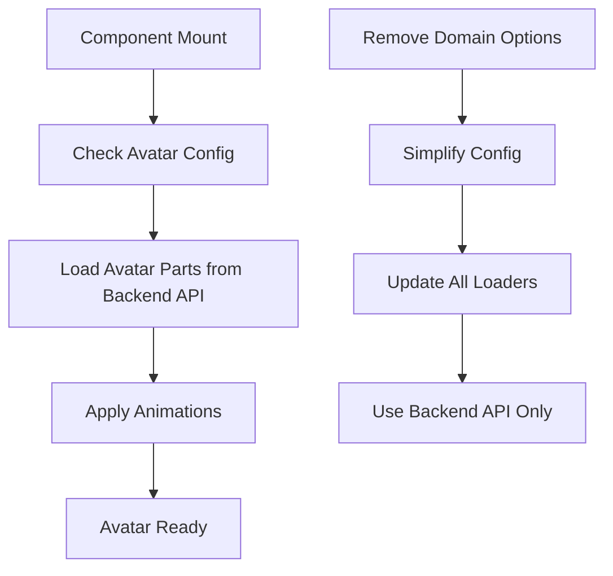

# Avatar Loading Fix và Domain Config Cleanup Requirements

## 1. Product Overview
Fix avatar parts loading issue khi khởi động web và cleanup domain configuration để đơn giản hóa codebase. Hiện tại avatar parts không được load tự động như room và items, gây ra trải nghiệm người dùng không nhất quán.

## 2. Core Features

### 2.1 Feature Module
Các trang cần được cập nhật:
1. **Avatar System**: Fix avatar parts loading logic để load tự động khi khởi động
2. **Domain Configuration**: Loại bỏ baseDomain, useResourceId và DISABLE_LOCAL_GLB_LOADING
3. **Room/Item Loaders**: Cập nhật để sử dụng backend API trực tiếp

### 2.2 Page Details

| Page Name | Module Name | Feature description |
|-----------|-------------|---------------------|
| Avatar System | useAvatarLoader | Fix avatar parts loading để load tự động khi component mount, đảm bảo consistency với room/item loading |
| Domain Config | appConfig.ts | Remove baseDomain, useResourceId, DISABLE_LOCAL_GLB_LOADING options |
| Room Loader | RoomLoader.tsx | Update để chỉ sử dụng backend API, loại bỏ fallback logic |
| Item Loader | ItemLoader.tsx | Update để chỉ sử dụng backend API, loại bỏ fallback logic |
| Avatar Loader | useAvatarLoader.ts | Update getAvatarPartUrl để chỉ sử dụng backend API |

## 3. Core Process

### Problem Analysis
1. **Avatar Loading Issue**: Avatar parts không được load tự động vì useAvatarLoader chỉ load khi avatarConfig thay đổi, không load khi component mount lần đầu
2. **Inconsistent Loading Logic**: Room và Items có logic load tự động trong useEffect, nhưng Avatar không có
3. **Complex Domain Config**: Có quá nhiều options (baseDomain, useResourceId, DISABLE_LOCAL_GLB_LOADING) gây confusion

### Solution Flow

## 4. User Interface Design

### 4.1 Design Style
- Không có thay đổi UI, chỉ là backend logic fixes
- Đảm bảo loading states được hiển thị consistent
- Error handling phải rõ ràng khi API calls fail

### 4.2 Page Design Overview

| Page Name | Module Name | UI Elements |
|-----------|-------------|-------------|
| Avatar System | Loading State | Hiển thị loading indicator khi avatar parts đang load |
| Error Handling | Error Messages | Hiển thị error message rõ ràng khi load fail |

### 4.3 Responsiveness
Không có thay đổi responsive, chỉ là logic fixes.

## 5. Technical Implementation Plan

### Phase 1: Fix Avatar Loading
1. Update useAvatarLoader để có useEffect load avatar khi component mount
2. Đảm bảo avatar parts load ngay khi có avatarConfig
3. Add proper error handling và loading states

### Phase 2: Remove Domain Config Options
1. Remove baseDomain từ appConfig.ts
2. Remove useResourceId option (default to true)
3. Remove DISABLE_LOCAL_GLB_LOADING option
4. Update tất cả loaders để chỉ sử dụng backend API

### Phase 3: Cleanup và Testing
1. Remove unused code và imports
2. Update error messages
3. Test avatar loading consistency
4. Verify room và item loading vẫn hoạt động

## 6. Success Criteria
1. Avatar parts load tự động khi web khởi động
2. Loading behavior consistent giữa avatar, room, và items
3. Codebase đơn giản hơn với ít config options
4. Tất cả assets load từ backend API only
5. Proper error handling khi API calls fail